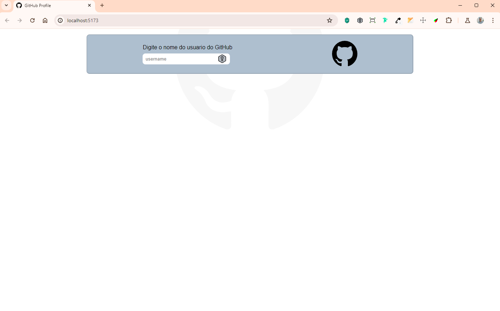

<!-- Banner de Apresentação -->
 

<br>
<br>

<!-- Minha Badge  -->
<div align="center">

</div>

<!-- Menu -->
<div align="center">

[Descrição](#-project-description-) |
[Funcionalidades](#%EF%B8%8Ffeatures) |
[Tecnologias](#technologies) |
[Instalação](#installation) |
[Deploy](#-web-project) |
[Referências](#-references) |
[Autor](#developed-by-)

</div>

<!-- Bagde dos Repositórios -->
<div  align="center" style="display: inline_block">


</div>

</br>
</br>

<!-- Titulo do Projeto -->
<div align="center"> 
<h1 text-align="center">

 Github API </h1>
</div>

<br>
<br>
<!-- Descrição do Projeto -->
<div align='left'>
<h2> ✅Project description: </h2> 
<br>
O GitHub API foi construido para visualizar os repositório Publicos de qualquer usuario do GitHub.

<div>

<br>
<br>

<!-- Imagem de Demostração -->
<h3 align="center"> Imagem de demostração do Projeto 

</h3>

<!-- Video de Demostraçào -->
 <!-- <h3 align="center">📽️project demonstration video</h3> -->


</div>

<br>
<br>

<div align='center'>
  <h2>⚙️Features</h2>
<div>
<div align="left">
🔹Integraçao com Web-API GitHub <br>
🔹Pesquisar por nome de usuarios<br>
</div>
<br>

<!--
 <div align="center">
 <h2>📸 Imagens do Projeto versão web.</h2>
<br>
<br>

> :bulb: **Dica:** Algumas imagens da versão Desktop.

<br>
<br>


</div>
<div>
 <h2>📱Imagens do Projeto verão Mobile.</h2>
<br>
 <br>

 > :bulb: **Dica:** Algumas imagens da versão Mobile.

<br>
<br>


</div> -->

<!-- Tecnologias Utilizadas -->
<h2>🪛Technologies</h2>
<br>

<div align='center'>


 
</div>

<br>

<div align='center'>
 <h2>💽Installation</h2>
</div>

<div>
<h6>built with technologies</h6>

<a href="https://react.dev/">
  </a>
&emsp;
<a href="https://vitejs.dev/">

</a>

</div>

<div align="left" width="300"px>

-**Pré Requisitos:**<br>

- **Para rodar o Projeto em seu computador é necessario ter instaldo em seu computador [node](https://nodejs.org/en), [git](https://git-scm.com/) e [Vscode](https://code.visualstudio.com/)**<br>
- **Caso não tenha essas tecnoligias, segue abaixo os link´s para instalação**

<br>

> 💾 - [node.js](https://nodejs.org/en)<br>
> 💾 - [vs-code](https://code.visualstudio.com/)<br>
> 💾 - [Git](https://git-scm.com/)<br>

</div>
<br>

<div align="left">

<!--
<h3>Configure Back-end</h3>
</br>
</br>

**Para que o projeto funcione o servidor Back-end precisar estar rodando. Para isso:**<br>

> 1- Faça o **clone do repositório** deste projeto para o seu computador.

<br>

> Caso não saiba o que é isso; **como fazer um clone de um Repositório no GitHub** vou deixar umn video aqui do [Willian Justen](https://willianjusten.com.br/) com o passo a passo de como fazer o clone de um Repositório do GitHub.
> [Como fazer um clone de um repositório no GitHub](https://www.youtube.com/watch?v=WEPB5pDSEIg)

> 2- <i>Faça o clone do Projeto utilizando esse comando<i>

<br>

```bash
 git clone git@github.com:rocketseat-education/nlw-unite-nodejs.git .
```

<br>

> 3-<i>Instale as dependências utlizando esse comando no Terminal</i>

<br>

```bash
 npm i
```

<br>

> 4- <i>Crie um arquivo na raiz do projeto chamado ".env" e dentro dele iremos inserir o seguinte comando </i> > </br>

```json
DATABASE_URL="file:./dev.db"
```

> 5- <i>Utilize esse comando dentro do terminal do VsCode</i>

```bash
 npx prisma db seed
```

<i>Isso irá alimentar o nosso Banco de Dados com alguns Dados Fictícios </i>

<br>

> 5-<i>Inicie o Servidor com o comando abaixo no Terminal do VsCode<i> > <br>

```bash
 npm run dev
```

<br>
</div>

\*\* ira aparecer no Terminal a seguinte mensagem:

> HTTP Server runnig!

**IMPORTANTE: DEIXE O SERVIDOR RODANDO NÃO FECHO O VSCODE**

<br>
<br>

</div> -->

<h3>Configure Front-End </h3>
</br>
</br>

1. Faça o clone do projeto:</h4>
   Caso não saiva como fazer um clone siga o passo a passo na documentação abaixo:


<a href="https://docs.github.com/pt/repositories/creating-and-managing-repositories/cloning-a-repository"> 
</a>


<br>
<br>

**Comando para executar o clone no terminal**

```bash
git clone  https://github.com/emmanuelmarcosdeoliveira/pass-in-web.git .
```

<br>
<br>

2. **Instale as dependências necessárias para que o projeto funcione**<br>

- Digite o comando no Terminal

```bash
 npm i
```

- Esse comando faz uma verificação de todas as Dependências necessária para a execução do projeto e faz a instalação dessas dependências para que você possa executar esse projeto.<br>
- Espere o processo ser concluido. ⌛</i>

<br>
<br>

3. **Inicie o servidor de Desenvolvimento com o seguinte comando dentro do Terminal**</br>

```bash
 npm run dev
```

<br>
<br>

4.  Pronto🏅
<br>
Será aberto uma janela no seu Navegador com o projeto sendo executado.<br>
Caso isso não ocorra digite na barra de endereço do navegador<br>
**localhost://http://localhost:5173/**<br>
Pronto agora Vocé já tem o projeto rodando; podendo verificar o código; fazer alterações. etc...
<br>

<h2 align="center">🌎 Web project</h2>
<div align="center">
Acesse o Projeto clicando no Link Abaixo<br>
<a href="https://github-profile-devoliveira.vercel.app/">
 
<a>
</div>
<br>
<br>

<!-- [](https://disney-plus-clone-dev-oliveira.vercel.app/) -->

<br>

<div align='center'>
<h2> 📚References</h2>
 </div>
<div align="center">

:memo: **Acesse:** [EBAC](https://ebaconline.com.br/)
<br>
<br>

</div>
<div align='center'>

<h2>📕License</h2>
<p>Released in 2024 This project is under the MIT license.</p>
<p>Designed by EBAC and developed by <strong>OliveirafullStack 🚀</p>
</br>
</br>

 <h2>👨🏻‍🦱Developed by </h2>
 <a href="https://oliveira-portifolio.vercel.app/">
 </a>

<a href ="https://wa.me/5511968336094"></a>
<a href = "mailto:oliveira.devfullstack@gmail.com"></a>
<a href="https://www.linkedin.com/in/oliveira-marcos-emmanuel?lipi=urn%3Ali%3Apage%3Ad_flagship3_profile_view_base_contact_details%3BUetG4s3ZT76Byt3XWdZ2Tg%3D%3D" target="_blank"></a>

<h3> 😁Obrigado por chegar até aqui! </h3>
&copy; Todos os Direitos Reservados
</div>
</br>
</br>
